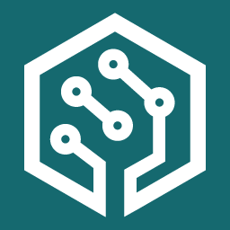
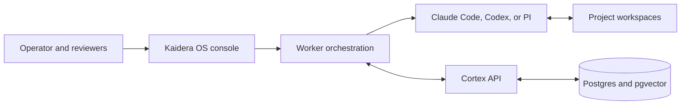

# Kaidera OS



Open-source local control plane for AI worker teams, powered by Cortex.

**[Documentation](https://docs.kaidera.ai)** |
**[Contribute](CONTRIBUTING.md)** |
**[Commercial edition](https://kaidera.ai/downloads/kaidera-os/macos)** |
**[Enterprise](https://kaidera.ai/for-enterprise)**

Kaidera OS connects project workspaces, external AI harnesses, and **Cortex** so
teams of AI workers can plan, execute, review, and resume real work without
losing project context. It runs locally, keeps project boundaries explicit, and
gives operators one surface for workers, handoffs, run state, approvals, and
durable evidence.

This repository is the AGPL community source. It contains no commercial trial,
license activation, Manifold client, or built-in BYOK model-provider integration.
AI work runs through separately installed and authenticated Claude Code, Codex,
or PI command-line harnesses. Kaidera OS discovers each harness's current models
and model-specific effort levels dynamically.

## What It Does

- Registers independent projects, workspaces, worker roles, and operating rules.
- Turns objectives into scoped handoffs with ownership and acceptance criteria.
- Runs external harnesses through one orchestration and run-state layer.
- Preserves decisions, messages, artifacts, and work products in Cortex.
- Applies human review and approval gates before consequential actions.
- Recovers interrupted work from durable state instead of starting over.
- Shows a project-specific Cortex graph for inspecting connected work and memory.

## Architecture



**Cortex is a permanent component name.** It is the shared project memory and
coordination layer, not a product label. See [How Kaidera OS works](docs/HOW_IT_WORKS.md)
for the full lifecycle.

## Install

Docker, Python 3.11 or newer, and at least one supported external CLI harness are
recommended. The installer reports missing prerequisites before changing the
system. A missing AI harness disables AI execution without crashing the app.

### Homebrew

```sh
brew install kaidera-ai/kaidera/kaidera-os
kaidera-os install
kaidera-os start
```

### npm

```sh
npm install --global @kaidera/kaidera-os
kaidera-os install
```

### curl

```sh
BASE=https://raw.githubusercontent.com/Kaidera-AI/homebrew-kaidera/main
curl -fsSL "$BASE/install.sh" | bash
```

Release launchers download the community archive from this repository and verify
its SHA-256 before extraction. The supported commercial macOS installer is
distributed separately from [kaidera.ai](https://kaidera.ai/downloads/kaidera-os/macos).

## Develop From Source

```sh
git clone https://github.com/Kaidera-AI/kaidera-os.git
cd kaidera-os
./install.sh
```

For development, install Node.js 22 and run the full checks before submitting a
material change:

```sh
make qa
```

The source tree starts with no customer project, generated worker identity,
credential, chat history, or local Cortex state. First-run configuration creates
local state on the operator's machine.

## Repository Map

| Path | Purpose |
| --- | --- |
| `.agents/api/` | Cortex API, memory, graph, and coordination services |
| `local-cortex/console/` | Kaidera OS backend, operator surface, and tests |
| `local-cortex/console/spa/` | React operator interface |
| `redistributable/` | Public schemas, examples, and startup tooling |
| `scripts/fitness/` | Privacy, naming, source-boundary, and package gates |

## Contribute

Bug reports, focused fixes, tests, documentation, accessibility improvements,
and portable runtime enhancements are welcome. Start with
[`CONTRIBUTING.md`](CONTRIBUTING.md), then open an issue or pull request.

Contributions must preserve the community source boundary and must never include
credentials, customer payloads, private paths, or copied chat history. Maintainers
can use the [community maintainer guide](docs/MAINTAINER_GUIDE.md) for review,
merge, release, and synchronization practices. Security reports follow
[`SECURITY.md`](SECURITY.md).

## Commercial and Enterprise

The supported commercial edition adds a packaged macOS installer, nine-day trial,
Kaidera-issued licensing, governed Manifold access, and support. It is distributed
from [kaidera.ai](https://kaidera.ai/downloads/kaidera-os/macos), not from this
source repository. Contact [sales@kaidera.ai](mailto:sales@kaidera.ai).

Kaidera AI provides enterprise identity, governed workspaces, operational controls,
and implementation support around Kaidera OS and Cortex.

## License

Kaidera OS community source is licensed under the
[GNU Affero General Public License v3.0 only](LICENSE). It is provided without
warranty or liability. Contributions are accepted under the same license. Kaidera
names and logos are not granted for use by the software license; see
[`NOTICE`](NOTICE).
