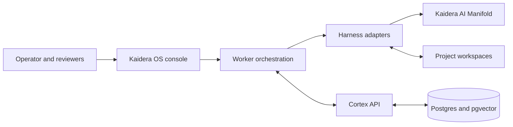

# Kaidera OS


Open-source local control plane for AI worker teams, powered by Cortex.

**[Documentation](https://docs.kaidera.ai)** |
**[Contribute](CONTRIBUTING.md)** |
**[Enterprise](https://kaidera.ai/for-enterprise)**

Kaidera OS connects project workspaces, AI harnesses, model providers, and
**Cortex** so teams of AI workers can plan, execute, review, and resume real work
without losing project context. It runs locally, keeps project boundaries
explicit, and gives operators one surface for workers, handoffs, run state,
provider configuration, and approvals.

This repository is the public community source and release home for Kaidera OS.
The separate
[`Kaidera-AI/homebrew-kaidera`](https://github.com/Kaidera-AI/homebrew-kaidera)
repository is a thin Homebrew and npm delivery layer.

## What it does

- Registers independent projects, workspaces, worker roles, and operating rules.
- Turns objectives into scoped handoffs with ownership and acceptance criteria.
- Runs supported harnesses through a common orchestration and run-state layer.
- Discovers models and reasoning-effort options dynamically when providers expose
  that metadata.
- Preserves decisions, evidence, messages, artifacts, and work products in Cortex.
- Applies human review and approval gates before consequential actions.
- Recovers interrupted work from durable state instead of starting over.

The open-source edition uses the OpenAI-compatible Kaidera AI Manifold edge.
Inference credentials stay in local configuration and are never part of this
repository. Direct third-party provider adapters are not included.

## How it fits together



**Cortex is a permanent component name.** It is Kaidera's project memory and
coordination layer, not a product label that changes when Kaidera OS branding
changes. See [How Kaidera OS works](docs/HOW_IT_WORKS.md) for the full lifecycle.

## Install

### Homebrew

```sh
brew install kaidera-ai/kaidera/kaidera-os
kaidera-os install
kaidera-os start
```

### npm

```sh
npm install --global @kaidera/kaidera-os
kaidera-os install
```

### curl

```sh
repo=Kaidera-AI/homebrew-kaidera
curl -fsSL "https://raw.githubusercontent.com/$repo/main/install.sh" | bash
```

The launchers verify the release SHA-256 before extracting the runtime. Release
archives, checksums, signatures, and source tags are published from this
repository. Homebrew formula metadata is maintained in the
[Kaidera tap](https://github.com/Kaidera-AI/homebrew-kaidera).

## Develop from source

Prerequisites are Python 3.12, Node.js 22, Docker, and a POSIX shell.

```sh
git clone \
  https://github.com/Kaidera-AI/kaidera-os.git
cd kaidera-os
./install.sh
python3 redistributable/scripts/validate-cortex-project-config.py \
  redistributable/examples/blank.project.json
cd local-cortex/console/spa && npm ci && npm test
```

Run the complete repository checks before submitting a material change:

```sh
make qa
```

The source tree starts with no customer project, generated worker identity,
credential, or local Cortex state. First-run configuration creates those items on
the operator's machine.

Source checkouts and release archives have the same open-source, Manifold-only
runtime boundary. Release packaging archives the reviewed commit without an
edition transformation.

## Repository map

| Path | Purpose |
| --- | --- |
| `.agents/api/` | Cortex API, memory, graph, and coordination services |
| `local-cortex/console/` | Kaidera OS backend, operator surface, and tests |
| `local-cortex/console/spa/` | React operator interface |
| `redistributable/` | Public schemas, examples, and startup tooling |
| `scripts/fitness/` | Release, privacy, naming, and package-boundary gates |

## Contribute

Bug reports, focused fixes, tests, documentation, accessibility improvements, and
portable runtime enhancements are welcome. Start with
[`CONTRIBUTING.md`](CONTRIBUTING.md), then open an issue or a pull request.

The public repository is intentionally free of customer payloads and internal
runtime state. Contributions must preserve that boundary and must never include
credentials, private paths, or copied chat history.

Maintainers can use the
[community maintainer guide](docs/MAINTAINER_GUIDE.md) for collaborator access,
review, merge, release, and source-synchronization practices. Security reports
follow [`SECURITY.md`](SECURITY.md).

## Kaidera AI

Kaidera AI is the enterprise platform for designing, governing, and operating AI
worker organizations. The managed service adds enterprise identity, governed
workspaces, Manifold model routing, operational controls, and implementation
support around Kaidera OS and Cortex.

- [Kaidera AI](https://kaidera.ai)
- [Enterprise service](https://kaidera.ai/for-enterprise)
- [Technology overview](https://kaidera.ai/technology)
- [Documentation](https://docs.kaidera.ai)
- [Kaidera AI on GitHub](https://github.com/Kaidera-AI)

## License

Kaidera OS community source is licensed under the
[GNU Affero General Public License v3.0 only](LICENSE) and is provided without
warranty or liability. Contributions are accepted under the same license.
Kaidera names and logos are not granted for use by the software license; see
[`NOTICE`](NOTICE). Commercial licensing and support are available from
[`sales@kaidera.ai`](mailto:sales@kaidera.ai).
