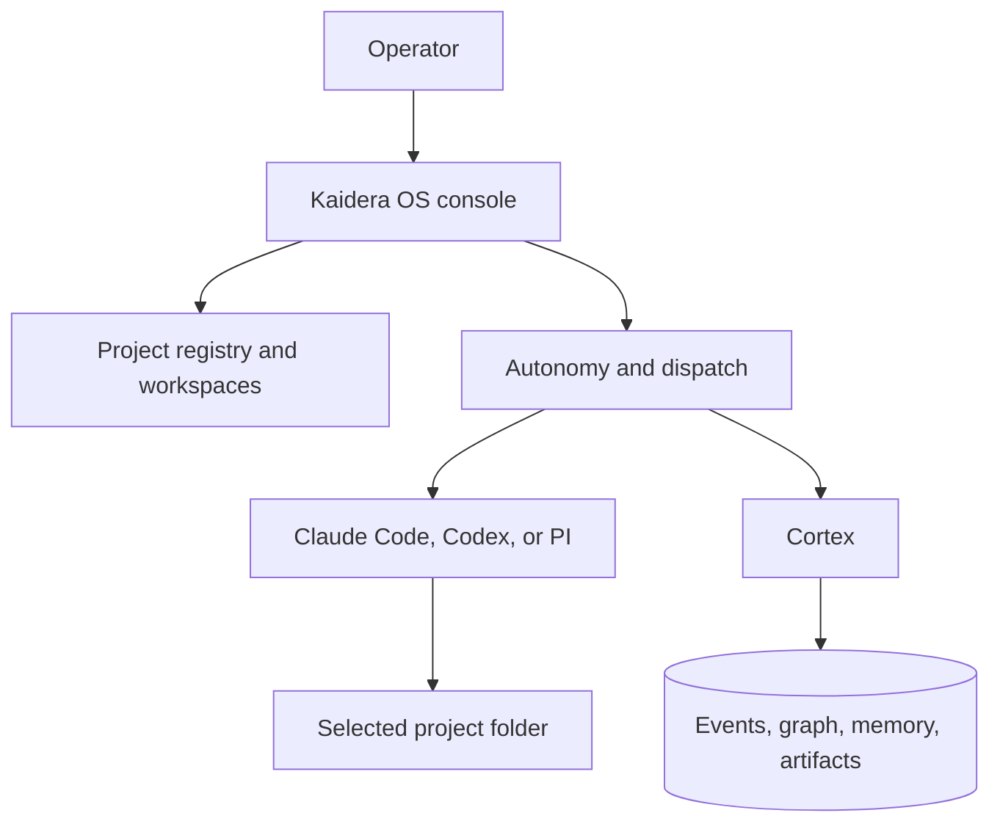

# How Kaidera OS Works

Kaidera OS is a local operating surface for project-scoped AI worker teams. It
combines an operator console, orchestration, external CLI harness adapters, and
the shared Cortex memory and coordination component.

A clean installation contains no baked project or worker team. The operator
creates the first project and lead worker through the startup flow.

## Components

### Console

The console manages projects, workers, configuration, handoffs, approvals, runs,
analytics, explain artifacts, and the current project's Cortex graph. Multiple
users can work in the same project when authentication is enabled; audit records
retain actor identity for governed actions.

### Harness adapters

The community source supports Claude Code, Codex, and PI as external command-line
harnesses. Kaidera OS does not accept model-provider API keys. Each harness owns
its own installation and authentication. The console queries the installed CLI
for model options and model-specific effort levels, caches successful discovery,
and falls back to a curated compatibility list when discovery is unavailable.

A missing CLI or authentication state disables the affected worker cleanly. Other
projects, workers, and Cortex remain available.

### Cortex

Cortex is the permanent shared component name. It stores project identities,
agents, handoffs, events, decisions, messages, artifacts, graph relationships,
and retrieval data. Every query is scoped to the selected project.

Kaidera OS includes Cortex in its community distribution. Product renames must
never rename Cortex or treat it as a product-specific label.

## Work Lifecycle

1. An operator registers a project and its canonical workspace folder.
2. Workers receive roles, operating instructions, a harness, and a model.
3. A lead or operator issues a handoff with scope and acceptance criteria.
4. Governance decides whether the handoff can run automatically or needs approval.
5. The orchestrator claims work and starts the selected external harness in the
   selected project's workspace.
6. Output, run state, tool activity, and evidence are streamed into the console.
7. Decisions and work products are logged to Cortex.
8. The project graph and history expose what happened and how items are connected.
9. Interrupted work resumes from durable state instead of an empty chat.

## Autonomy

Project autonomy is a durable project setting. When enabled, the project manager
heartbeat watches for scheduled work, pending handoffs, expired leases, and worker
responses. Approval policy still gates consequential work. Disabling autonomy is
the kill switch and prevents new autonomous dispatches.

## Community Boundary

The public AGPL source has one immutable community identity. It contains no
commercial trial, license activation, Manifold client, native commercial package,
or built-in BYOK model-provider implementation. CI checks this source boundary.

The supported commercial edition is built from a private engineering repository
and is distributed from [kaidera.ai](https://kaidera.ai/downloads/kaidera-os/macos).
Contact [sales@kaidera.ai](mailto:sales@kaidera.ai) for licensing and support.

## Security and Privacy

- No customer project, credential, chat history, or generated identity ships in
  the source archive.
- External harness credentials remain owned by those harnesses.
- Child processes receive a credential-sanitized environment.
- Project workspace paths are validated and scoped.
- Shared deployments should enable authentication and HTTPS.
- Release archives publish SHA-256 checksums and are built from committed source.
