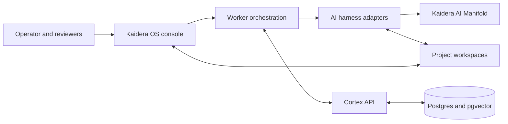

# How Kaidera OS works

Kaidera OS is a local control plane for AI worker teams. It connects project
workspaces, model providers, harnesses, and Cortex so work can be planned,
executed, reviewed, and resumed without losing project context.

## System overview

## Main components

### Kaidera OS console

The console is the operator surface. It registers projects and workers, shows
handoffs and run state, configures Manifold, and exposes controls for
starting, stopping, reviewing, and recovering work.

### Worker orchestration

The orchestration layer watches project handoffs and schedules eligible workers.
It maintains run state, heartbeats, approval gates, and failure recovery. A worker
is not just a chat tab: it has a project identity, role, scope, and auditable work
item.

When project autonomy is enabled, the orchestrator keeps the project management
heartbeat active, runs eligible scheduled work, and dispatches pending handoffs
to available workers. Runtime policies still control approvals, sandboxes,
retries, budgets, and consequential actions.

### Harness adapters

Harness adapters translate a common worker contract into each supported coding or
agent runtime. They discover current models, capability metadata, and available
reasoning-effort levels dynamically when a provider or harness exposes them.
Static compatibility data is a fallback, not the primary
catalogue.

Harness-specific process details remain inside the adapter. The orchestrator sees
consistent identity, workspace, prompt, run-state, cancellation, and evidence
contracts.

### Provider layer

Provider configuration supplies an endpoint, inference key, and project ID to the
Kaidera harness. Both source checkouts and release archives use the
OpenAI-compatible Kaidera AI Manifold edge. Model and reasoning-effort metadata
is read dynamically from that edge.

A missing or revoked provider credential disables the affected worker cleanly. It
must not crash the Console or expose another provider's credential.

### Cortex

Cortex is the permanent name of Kaidera's project memory and coordination layer.
It stores decisions, handoffs, evidence, work products, messages, artifacts, and
retrieval indexes. Project boundaries are enforced so one project's context does
not silently become another project's instructions.

Cortex is shared infrastructure inside Kaidera OS and is included in the public
runtime. Its name is independent from product or company rebrands.

### Project workspaces

Customer and project files live outside the Kaidera OS product payload. A fresh
installation contains no baked project or worker team. The startup flow registers
the first workspace and creates local runtime configuration for that project.

## A typical work cycle

1. An operator registers a project workspace and worker team.
2. A lead worker turns an objective into scoped handoffs and acceptance criteria.
3. The orchestrator assigns eligible work to specialist workers.
4. Harness adapters run those workers against the selected model provider.
5. Workers read and update the project workspace within their configured sandbox.
6. Cortex records run state, decisions, evidence, and completed work products.
7. Human review gates approve material changes before merge, release, or delivery.
8. Later workers resume from Cortex context instead of rediscovering completed work.

## Licensing

This repository is licensed under `AGPL-3.0-only` and has no runtime trial,
activation, or signed feature-grant system. It is provided without warranty or
liability. A separately distributed commercial edition with support is available
from `sales@kaidera.ai`.

Manifold is a separately operated service and validates its own inference
credentials server-side. Missing, invalid, or unreachable Manifold configuration
disables affected AI work cleanly without crashing Kaidera OS.

## Installation channels

Open-source installation channels resolve to a versioned source release:

- **Homebrew:** the versioned runtime plus the `kaidera-os` CLI.
- **npm:** a small launcher that downloads and verifies the matching runtime.
- **curl:** the release archive and checksum followed by the canonical installer.

Release archives are versioned. Installers verify SHA-256 before using a
downloaded runtime. npm publications use GitHub OIDC trusted publishing rather
than a long-lived registry token.

## Security boundaries

- Secrets belong in local environment or credential stores, never in Git.
- Cortex commands use the API boundary rather than direct database access.
- Project identity, memory, and handoff routing are project-scoped.
- Public release files are checksummed and signed.
- Untrusted pull-request code must never receive release, signing, registry, or
  production credentials.
- Customer payloads and generated runtime state are excluded from public source.

## Community and enterprise

Kaidera OS provides the open-source local worker and Cortex runtime. The Kaidera
AI enterprise service adds managed identity, governed workspaces, model routing,
organization-level controls, and implementation support.

- [Kaidera OS source](https://github.com/Kaidera-AI/kaidera-os)
- [Public distributions](https://github.com/Kaidera-AI/homebrew-kaidera)
- [Enterprise service](https://kaidera.ai/for-enterprise)
- [Documentation](https://docs.kaidera.ai)
